# Automated Payments - RPA Project - UiPath State Machine Workflow

## Process Short Description
A practice project that I have developed as part of the "State Machines in Studio" course at UiPath Academy.

In this project, I've developed a state machine with five states:
- Get Initial Balance
- Get Payment Value
- Make Payment - if the funds are available
- Deny Payment - if the funds are insufficient
- Final State to end the process

## Certificate:
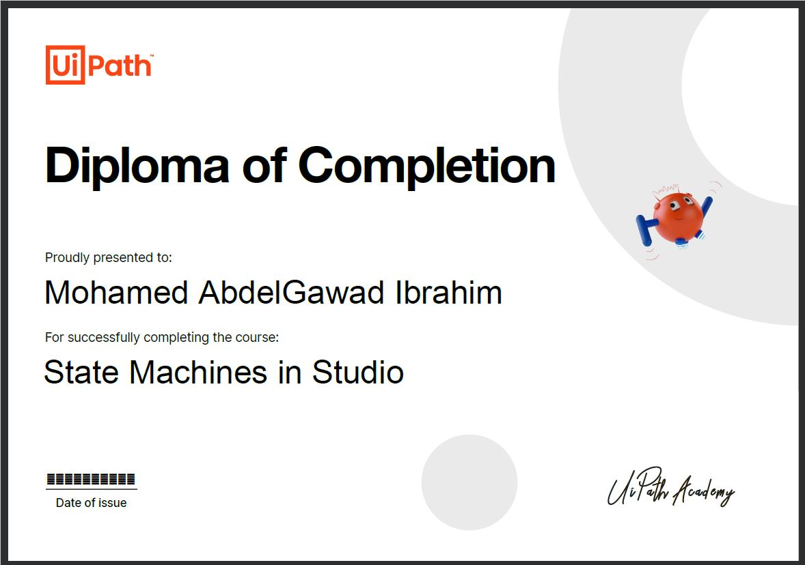

## States and Transitions Screenshots

### State Machine
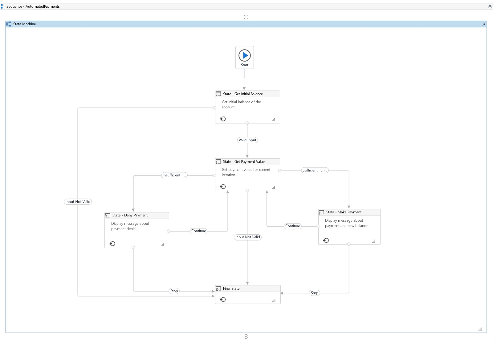

### Get Initial Balance State
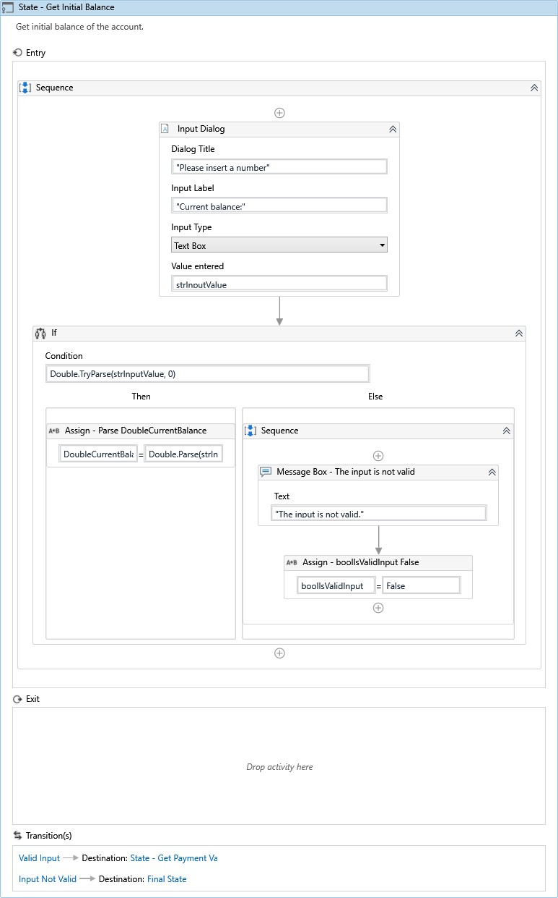

### Get Payment Value State
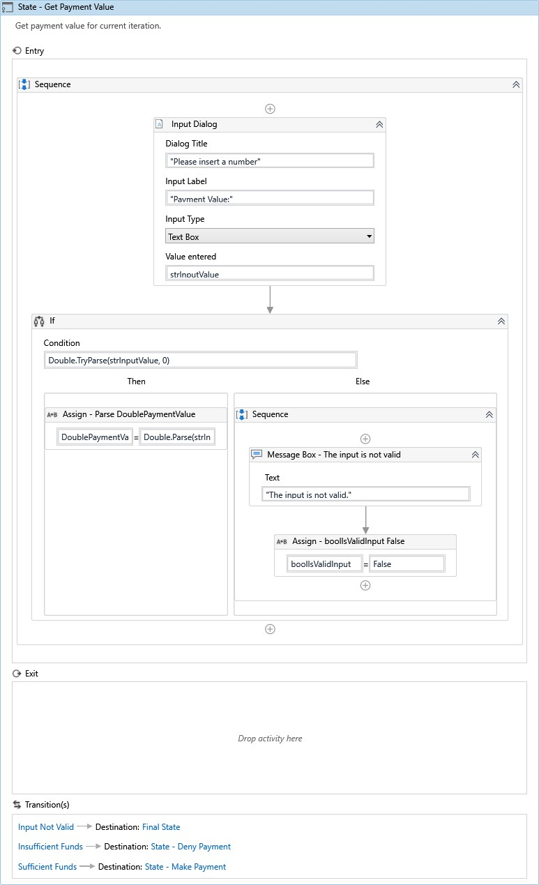

### Make Payment State
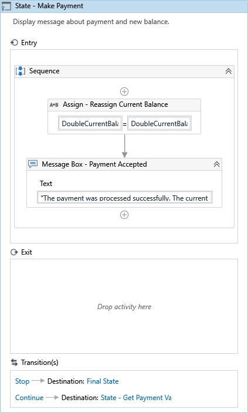

### Deny Payment State
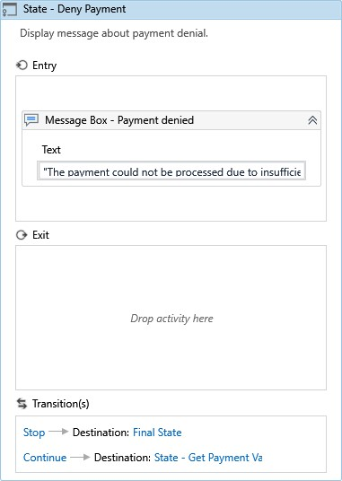

### Final State
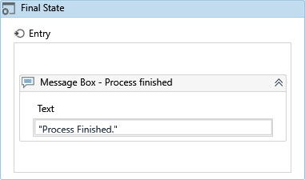

### Valid Input Transition
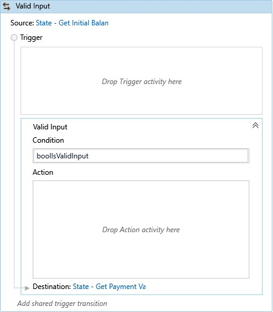

### Input Not Valid Transition
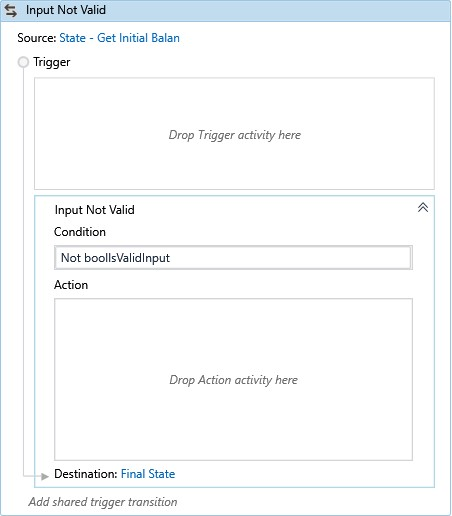

### Sufficient Funds Transition
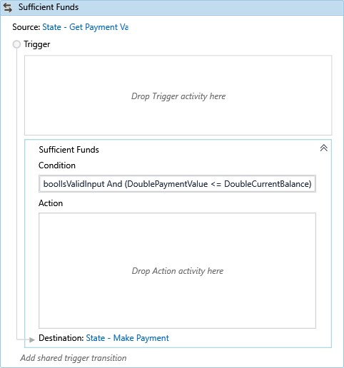

### Insufficient Funds Transition
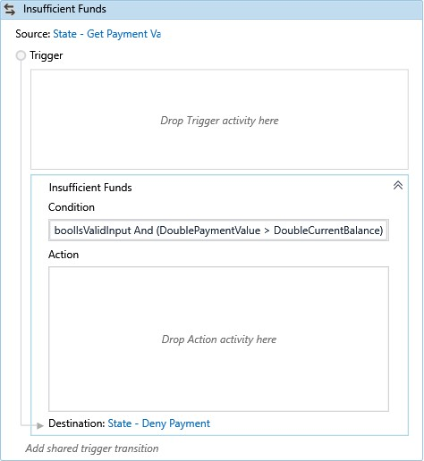

### Continue Transition
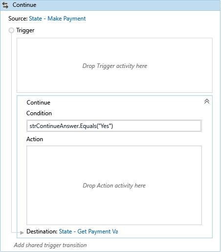

### Stop Transition
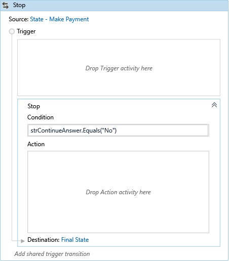

## About The Author

* Author: Mohamed Abdel-Gawad Ibrahim
* Contact: muhammadabdelgawwad@gmail.com
* Phone: +201069052620 || +201147821232